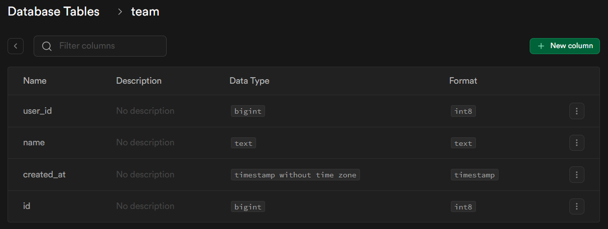
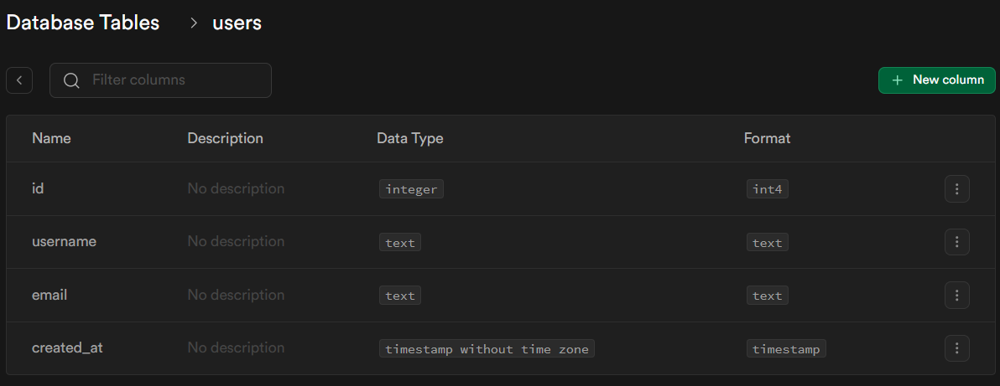
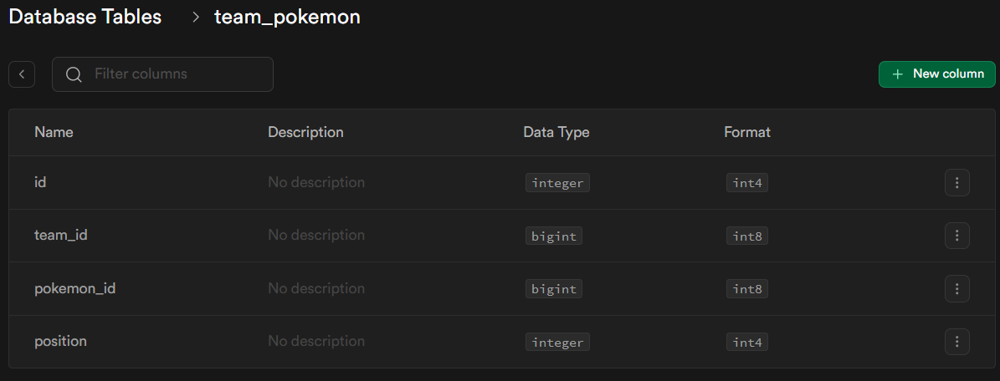

# pokemon-battle-app

## Prerequisites

- **Node.js**: Ensure you have Node.js version 18.13 installed.
- **Angular CLI**: To manage the Angular project, install Angular CLI globally:
  ```bash
  npm install -g @angular/cli
  ```

## Project Structure

- backend/ - Contains the Node.js backend API.
- frontend/ - Contains the Angular frontend application.

## Setup Instructions

### Backend Setup

1. Navigate to the backend folder:

```bash
    cd backend
```

2. Install dependencies:

```bash
    npm install
```

3. Configure **environment variables**, one way is to create a **.env** file in the "backend" folder:

```
    SUPABASE_KEY="Your_Key"
```

4. Run the backend server:

```bash
    node app.js
```

The backend server should now be running on the specified port (default: http://localhost:5000).

### Frontend Setup

1. Navigate to the frontend folder:

```
    cd ../frontend
```

2. Install dependencies:

```
    npm install
```

Configure environment settings:

3. Run the frontend application:

```
    ng serve
```

The frontend should now be running on http://localhost:4200.

Running the Full Application
After completing the setup steps above, you can access the app as follows:

- Frontend: http://localhost:4200
- Backend: http://localhost:5000 (or as configured)

## Database Schema:

### Requirement 4:

- Tables:

Team:



Users:



Join table between pokemons and teams:



```
CREATE TABLE user (
    id UUID PRIMARY KEY DEFAULT gen_random_uuid(),
    username TEXT UNIQUE NOT NULL,
    email TEXT UNIQUE NOT NULL,
    created_at TIMESTAMP DEFAULT NOW()
);

CREATE TABLE team (
    id UUID PRIMARY KEY DEFAULT gen_random_uuid(),
    user_id UUID REFERENCES user(id) ON DELETE CASCADE,
    name TEXT NOT NULL,
    created_at TIMESTAMP DEFAULT NOW()
);

CREATE TABLE team_pokemon (
    id UUID PRIMARY KEY DEFAULT gen_random_uuid(),
    team_id UUID REFERENCES team(id) ON DELETE CASCADE,
    pokemon_id UUID REFERENCES pokemon(id) ON DELETE CASCADE,
    position INTEGER CHECK (position BETWEEN 1 AND 6),
    UNIQUE (team_id, position)
);

```

Explanation: this is the most basic case of a many to many relationship, it is also the most natural and intuitive solution to the 4th requirement of the assignement, where each team can have many pokemons, and each pokemon can be a part of many teams. In addition, the constraints set on the columns (such as the position in team_pokemon), assure that the conditions layed out in the requirement are met.

### Requirement 5:

- insert_team:

```
CREATE OR REPLACE FUNCTION insert_team(
    user_id INT8,
    team_name TEXT,
    pokemon_ids INT8[]
)
RETURNS VOID AS $$
DECLARE
    team_id BIGINT;
BEGIN
    -- Check that exactly 6 Pokémon are provided
    IF array_length(pokemon_ids, 1) != 6 THEN
        RAISE EXCEPTION 'A team must consist of exactly 6 Pokémon';
    END IF;

    -- Insert the new team into the team table
    INSERT INTO team (user_id, name)
    VALUES (user_id, team_name)
    RETURNING id INTO team_id;

    -- Insert each Pokémon into team_pokemon with its position
    FOR i IN 1..6 LOOP
        INSERT INTO team_pokemon (team_id, pokemon_id, position)
        VALUES (team_id, pokemon_ids[i], i);
    END LOOP;
END;
$$ LANGUAGE plpgsql;
```

- get_all_pokemon_teams:

```
CREATE OR REPLACE FUNCTION get_all_pokemon_teams()
RETURNS TABLE(team_id BIGINT, team_name TEXT, total_power BIGINT)
LANGUAGE plpgsql
AS $$
BEGIN
    RETURN QUERY
    SELECT
        t.id AS team_id,
        t.name AS team_name,
        SUM(p.power) AS total_power
    FROM
        team t
    JOIN
        team_pokemon tp ON t.id = tp.team_id
    JOIN
        pokemon p ON tp.pokemon_id = p.id
    GROUP BY
        t.id, t.name
    ORDER BY
        total_power DESC;
END;
$$;
```
